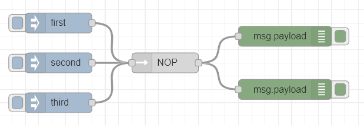

# NOP

A simple node that just does nothing.



## Install

```
$ npm install node-red-contrib-nooperation
```

## Usage

All input messages are just sent out again.

This is useful to prettify n &times; m connections.

## Example Flow

[example flow](examples/NOP-example.json)

## Author

[Mathias Schäffler](https://github.com/m-schaeffler)

## License

LGPL-2.1
