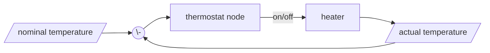

# @mschaeffler/node-red-thermostat

A Node Red node to control an (electric) heater.


## Install

```
$ npm install @mschaeffler/node-red-thermostat
```

A heating device that just can be switched on and off, can be closed loop controlled:



## Input

|msg.    | type   | description                       |
|:-------|:-------|:----------------------------------|
|payload | object | data to control the thermostat |

There are two different ways to control the thermostat:

### direct control

`msg.payload` is a destinct value:

|msg.payload| type  | description |
|:------|:------|:------------|
|`true` |boolean| starts heating according to already set data |
|`false`|boolean| stops heating |
|`on`   |string | starts heating according to already set data |
|`off`  |string | stops heating |
|`1`    |number | sets the cycle count to 1 and starts heating |
|`2`    |number | sets the cycle count to 2 and starts heating |
|`3`    |number | sets the cycle count to 3 and starts heating |
|`4`    |number | sets the cycle count to 4 and starts heating |
|`5`    |number | sets the cycle count to 5 and starts heating |
|`0`    |number | stops heating |

### control woith objects

`msg.payload` is an object with at least one of these members:

|msg.payload.| type  | description |
|:------|:------|:------------|
|temperature|number | actual temperature for the closed loop control |
|block|boolean| blocks the heating (e.G. open window)|
|nominal|number | nominal temperature |
|factor|number |multilies the control coefficent (parameter factor) with this value |
|cycleTime|number | sets the cyclic time |
|cycleCount|number | sets the nuber of cycles |

## Outputs

### state feedback

This is the general feedback: heating is on or off.

|msg.    | type   | description                       |
|:-------|:-------|:----------------------------------|
|topic   | string | parameter `topic`|
|payload |  | value according to parameter `feedback`|

### control output

This controls the heater according to the cycles.

|msg.    | type   | description                       |
|:-------|:-------|:----------------------------------|
|topic   | string | parameter `topic`|
|payload |boolean | control value to switch the heater|

## Parameters

|config    | type   | description                       |
|:---------|:-------|:----------------------------------|
|topic     | string | topic value for the output messages |
|nominal   | number | nominal temperature for the closed loop control |
|minDelta  | number | actual temp must be by this value lower then the nominal to start heating |
|summand   | number | additional summand for the closed loop control |
|factor    | number | control coefficient for the closed loop control |
|cycleTime | number | time period of one heating cycle |
|cycleCount| number | number of heating cycles |
|feedback  | string | style of the state feedback |

### feedback formats

There are four formats for the state feedback:

|feedback type| description                       |
|:------------|:----------------------------------|
|Boolean      | boolean value |
|"on" / "off" | strings `"on"` or `"off"` |
|1 / 0        | numbers `1` or `0` |
|cycle count  | numbers `cycleCount` or `0` |

## Example Flow

[example flow](https://github.com/m-schaeffler/node-red-my-nodes/raw/main/node-red-thermostat/examples/thermostat.json)

## Author

[Mathias Schäffler](https://github.com/m-schaeffler)

## License

LGPL-2.1
